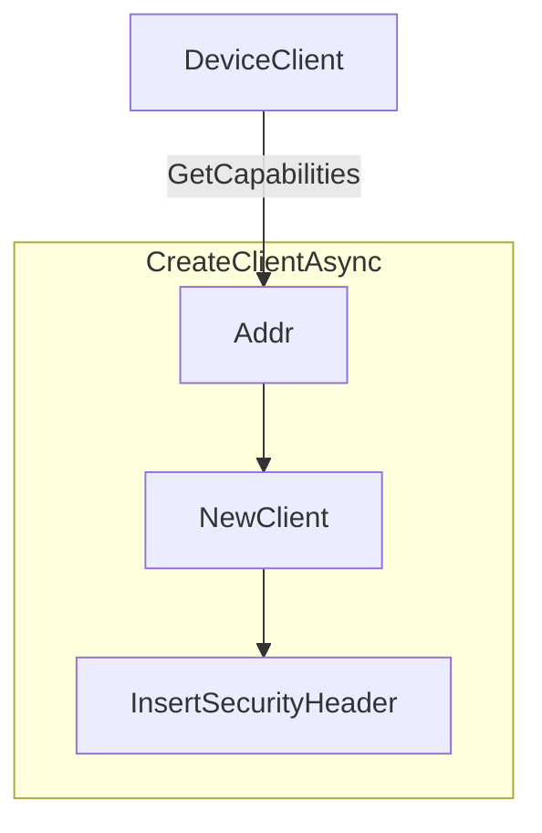
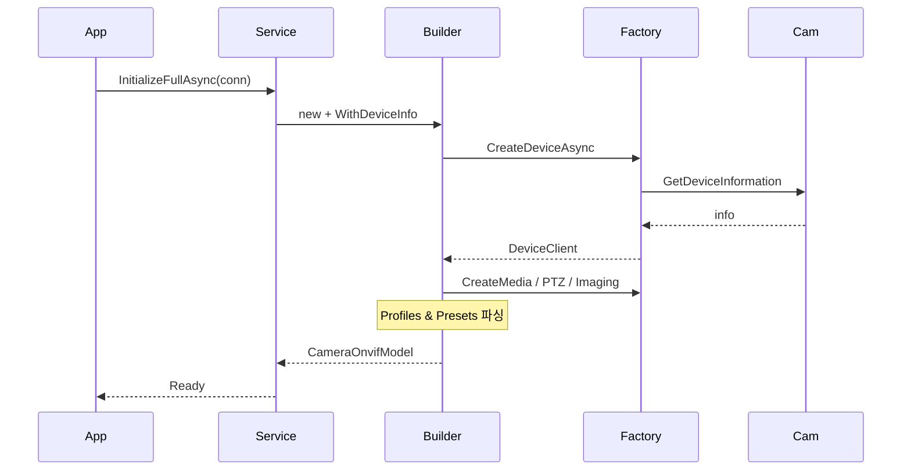

# Ironwall ONVIF Solution  
*(Factory → Builder → Service 3-Layer Toolkit)*

**Latest preview** : `v0.9.0`

---

## 🎯 Goal

ONVIF 카메라의 **메타데이터·스트림·PTZ/Imaging** 제어를 .NET 에서 *한 줄*로 구현할 수 있도록  
― **Factory / Builder / Service** 로 계층화된 재사용형 SDK ― 을 제공합니다.

---

## 🗂️ Top-level Structure

| Layer          | 핵심 책임                               | 대표 타입/파일                                                          |
| -------------- | ------------------------------------ | ----------------------------------------------------------------------- |
| **Factories**  | SOAP Binding & WCF 프록시 생성               | `DefaultBindingFactory`, `OnvifClientFactory`, `ServiceFactory`(legacy) |
| **Helpers**    | DTO ↔ WSDL 매핑, WS-Security 헤더          | `OnvifMappingHelper`, `SoapSecurityHeader*`                             |
| **Models**     | 직렬화 가능한 POCO/DTO                     | `CameraOnvifModel`, `CameraProfileDto`, `PTZPresetDto` …                |
| **Builder**    | *한 대* 카메라의 초기 데이터 풀 수집          | `OnvifModelBuilder`                                                     |
| **Services**   | *여러* 카메라 캐싱·제어                      | `OnvifService`                                                          |
| **Tests**      | xUnit 단위 테스트                           | `OnvifModelBuilderTests`, `OnvifServiceTests`                           |

<details>
<summary>📁 Directory snapshot (발췌)</summary>

```

Ironwall.Dotnet.Libraries.OnvifSolution
├─ Factories
│   ├─ BindingFactory.cs
│   ├─ OnvifClientFactory.cs
│   └─ ServiceFactory.cs
├─ Builders
│   └─ OnvifModelBuilder.cs
├─ Services
│   └─ OnvifService.cs
├─ Helpers  … (mapping / security)
├─ Models   … (Camera\*, Profile\*, PTZ\*)
└─ Tests    … xUnit

````
</details>

---

## 1 Factory · Binding · Security Layer

### 1.1 Binding 유틸

| 파일 | 설명 |
|------|------|
| **`IBindingFactory`** | `Binding Create()` 만 노출하는 최소화 인터페이스 |
| **`DefaultBindingFactory`** | SOAP 1.2 + UTF-8 + HTTP-Digest 바인딩을 **Lazy-Singleton** 으로 캐싱 |

```
var binding = new CustomBinding {
    Elements = {
        new TextMessageEncodingBindingElement {
            MessageVersion = MessageVersion.CreateVersion(
                               EnvelopeVersion.Soap12, AddressingVersion.None),
            WriteEncoding  = Encoding.UTF8 },
        new HttpTransportBindingElement {
            AllowCookies = true,
            MaxReceivedMessageSize = int.MaxValue,
            AuthenticationScheme   = AuthenticationSchemes.Digest }
    }
};
````

> **왜 Factory?**
>
> * 바인딩 설정을 **중앙 집중** 관리.
> * DI 컨테이너에 구현을 주입해 **Mock** 으로 교체 가능.

---

### 1.2. `OnvifClientFactory` (DI 등록용 `internal sealed`)

| 메서드                                                      | 특징                                                                |
| -------------------------------------------------------- | ----------------------------------------------------------------- |
| `CreateDeviceAsync`                                      | DeviceClient 생성 + HTTP-Digest + WS-UsernameToken + 시계보정           |
| `CreateMediaAsync / CreatePtzAsync / CreateImagingAsync` | 제네릭 **`CreateClientAsync<T>`** 하나로 구현 → Capability → XAddr → 보안헤더 |



#### 시간 보정 유틸

```csharp
async Task<TimeSpan> GetDeviceTimeShiftAsync(DeviceClient dev) { … }
```

카메라 UTC ↔ PC UTC 차이를 구해 WS-Security 서명 오차 방지.

---

### 1.3. `ServiceFactory` (정적 헬퍼)

* DI 를 쓰지 않는 프로젝트에서도 **즉시 호출** 가능.
* `CreateDeviceClientAsync`, `CreateMediaClientAsync` … 등 메서드별 래퍼 제공.
* 내부 로직은 `OnvifClientFactory` 와 동일하지만 **정적/간편** 스타일.

---

### 1.4. Quick Facts

| 항목            | 값                                       |
| ------------- | --------------------------------------- |
| Protocol      | SOAP 1.2 (Text Encoding + HTTP)         |
| Auth          | HTTP-Digest **+** WS-UsernameToken      |
| Thread-Safety | Binding → Singleton / Client → Per-Call |
| Time-Shift    | `GetSystemDateAndTime` 결과로 서명 시각 보정     |

---

## 2. OnvifModelBuilder – 카메라 1대 풀스캔

| 순서 | 메서드                                                                  | 내용                                                                                |
| -- | -------------------------------------------------------------------- | --------------------------------------------------------------------------------- |
| ①  | **`WithDeviceInfoAsync`**                                            | 제조사·펌웨어·MAC·Scope 등 + DeviceClient                                                |
| ②  | `WithCreateMediaAsync / WithCreatePtzAsync / WithCreateImagingAsync` | 각 기능 지원 여부 & 프록시 생성                                                               |
| ③  | **`WithProfilesAsync`**                                              | 모든 Profile → `CameraProfileDto` (Encoder, Source, Metadata, Analytics, StreamURI) |
| ④  | `WithPTZPresetsAsync`                                                | PTZ 프리셋 목록                                                                        |
| ★  | **`Build / BuildAsync`**                                             | `CameraOnvifModel` 반환<br> · 오류 시 `NOT_AVAILABLE`                                  |

#### 2.1. Fluent Helper

```csharp
var model = await new OnvifModelBuilder(conn, factory, conn, log)
                     .WithDeviceInfoAsync(ct)
                     .Do(b => b.WithCreateMediaAsync(ct))
                     .Do(b => b.WithProfilesAsync(ct))
                     .BuildAsync();
```

`OnvifModelBuilderExtensions.Do()` 는 `Task<OnvifModelBuilder>` 체이닝용 **await helper**.

---

## 3. OnvifService – 런타임 오케스트레이션

| API                      | 설명                                                      |
| ------------------------ | ------------------------------------------------------- |
| `InitializeDeviceAsync`  | DeviceClient + 기본 메타만 필요할 때                             |
| `InitializeProfileAsync` | Media‧PTZ 포함 Profile 까지                                 |
| `InitializeFullAsync`    | + PTZ Presets → **완전 초기화**                              |
| PTZ 명령                   | `GoPTZPreset`, `MovePTZ`, `StopPTZ`, `SetHomePreset` …  |
| Imaging 명령               | `MoveImaging`, `StopImaging`                            |
| 캐시                       | `ConcurrentDictionary<string, ICameraModel>` 로 중복 호출 차단 |
| 실패 정책                    | try/catch 후 `CameraStatus` 변경, 서비스 전체는 **정상 유지**        |

---

### 3.1 풀-초기화 내부 구현 예

```csharp
public async Task<ICameraOnvifModel?> InitializeFullAsync(
        IConnectionModel conn, CancellationToken ct = default)
{
    var onvifConn = new OnvifConnectionModel(conn);
    var key       = $"{onvifConn.Host}_{DateTime.UtcNow.Ticks}";

    // 캐시 검사 …
    var model = await new OnvifModelBuilder(onvifConn, _factory, conn, _log)
                    .WithDeviceInfoAsync(ct)          // 첫 단계
                    .Do(b => b.WithCreateMediaAsync(ct))
                    .Do(b => b.WithCreatePtzAsync(ct))
                    .Do(b => b.WithCreateImageingAsync(ct))
                    .Do(b => b.WithProfilesAsync(ct))
                    .Do(b => b.WithPTZPresetsAsync(ct))
                    .BuildAsync();

    if (model?.CameraStatus == EnumCameraStatus.AVAILABLE)
        _camMap[key] = model;                         // 캐시 갱신

    return model;
}
```

> 위 예시는 **Builder 체이닝** 이 실제 서비스에서 어떻게 활용되는지 보여 줍니다.
> 각 단계에서 `CancellationToken` 을 전달해 **중단 가능**하며, 실패 시에도 다음 단계로 넘어가도록 설계되어 있습니다.

---

## 4. 모델 & DTO 카탈로그

| 그룹      | 타입                                           | 핵심 필드                                             |
| ------- | -------------------------------------------- | ------------------------------------------------- |
| Device  | `CameraOnvifModel`                           | Manufacturer, Firmware, ServiceUri, *Client refs* |
| Profile | `CameraProfileDto`                           | VideoEncoderConfig, AudioSourceConfig, MediaUri   |
| PTZ     | `PTZPresetDto`, `PTZConfigDto`, `PTZNodeDto` | Token, Name, PTZ 범위                               |
| Imaging | `FocusMoveDto` 등                             | Move Speed, AutoFocus Mode                        |

모든 클래스는 `Newtonsoft.Json` 속성 → 파일 저장·REST 응답 OK.

---

## 5. Sequence (Initialize Full)



---

## 6. Quick Start

```csharp
// 1) DI 등록 (Autofac 예시)
builder.RegisterType<DefaultBindingFactory>()
       .As<IBindingFactory>().SingleInstance();
builder.RegisterType<OnvifClientFactory>()
       .As<IOnvifClientFactory>().SingleInstance();
builder.RegisterType<OnvifService>()
       .As<IOnvifService>().SingleInstance();

// 2) 사용
var svc  = scope.Resolve<IOnvifService>();

var cam  = await svc.InitializeFullAsync(
               new ConnectionModel("192.168.1.77", 80, "admin", "pass"));

Console.WriteLine($"Model = {cam.DeviceModel}");
await svc.GoPTZPreset(cam.PtzClient, new PtzSpeedDto(1,1,0),
                      cam.CameraMedia.Token, cam.CameraMedia.PTZPresets[0].Token);
```

---

## 특징 요약

| ✔            | Reason                                       |
| ------------ | -------------------------------------------- |
| DI 친화        | 모든 핵심 컴포넌트가 인터페이스 → Mock 테스트 용이              |
| Fluent async | 체이닝 + `CancellationToken` 전파                 |
| Security     | HTTP-Digest + WS-UsernameToken + *TimeShift* |
| Fail-Soft    | 단계별 try/catch, 치명적 오류만 `NOT_AVAILABLE`       |
| 테스트 포함       | Builders / Services xUnit 커버리지               |

> ☞ **다음 장** : DTO 매핑 표, 단위 테스트, WPF 샘플 UI 등 세부 사용법을 다룹니다.

